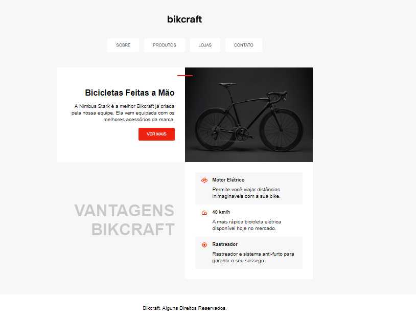

# 📋 Indíce

- [Bem-vindo](#id01)
- [Proposta](#id02)
- [Objetivo](#id03)
- [Aprendizado](#id04)
- [Prosseguimento](id05)
- [Screenshots](#id06)
- [Links](#id07)
- [Tecnologias utilizadas](#id08)
- [Pré-requisitos](#id09)
- [Procedimentos de instalação](#id010)
- [Autora](#id011)

# Bem-vindo! 👋 <a name="id01"></a>

**Desafio Bikcraft.**

Criação de um site em HTML5 e CSS3.  
<br />

## 🚀 Proposta <a name="id02"></a>

Desenvolver um site utilizando CSS Grid Layout.

Este projeto foi um desafio proposto no curso de [HTML e CSS para Iniciantes](https://www.origamid.com/curso/html-e-css-para-iniciantes/) da Origamid.

<br />

## :trophy: Objetivo <a name="#id03"></a>

Introduzir conceitos de CSS Grid Layout.

## :trophy: Aprendizado <a name="#id04"></a>

- Grid
- Flexbox
- Pseudo Classes
- Pseudo Elements
- Tag semântica
- Acessibilidade

## :trophy: Prosseguimento <a name="id05"></a>

- Tornar o site bikcraft responsivo.

<br />

# :camera_flash: Screenshots <a name="id06"></a>

## :desktop_computer: Desktop design



## :iphone: Mobile design


<br />

# :heavy_check_mark: Links <a name="id07"></a>

<br />

- Para acessar o site [Clique aqui](INSERIR LINK)

<br />

# 🛠 Tecnologias utilizadas <a name="id08"></a>

<br />

- HTML5
- CSS3

<br />

# ☑️ Pré-requisitos <a name="id09"></a>

<br />

- [x] Editor de código de sua preferência (recomendado VS code)
- [x] Git

<br />

# 📝 Procedimentos de instalação <a name="id010"></a>

<br />

Clone este repositório usando o comando:

```bash
git clone https://github.com/RaizaCirne/bikcraft-desafio.git
```

Baixar arquivo zip

Extrir arquivos

Abrir pasta no editor de código.

<br />

# :sunglasses: Autora <a name="id011"></a>

<br />

- Personal Page - [Raíza Cirne Braz](https://lively-kangaroo-a1eaa7.netlify.app/)
- Frontend Mentor - [@RaizaCirne](https://www.frontendmentor.io/profile/RaizaCirne)
- GitHub - [RaizaCirne](https://github.com/RaizaCirne)
- LinkedIn - [Raíza Cirne Braz](https://www.linkedin.com/in/ra%C3%ADzacirne/)

**HTML - CSS** 🚀
